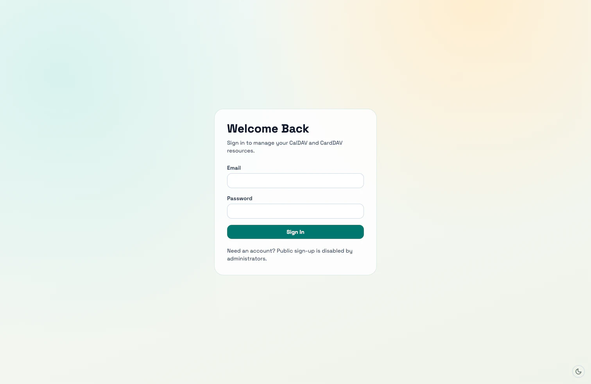
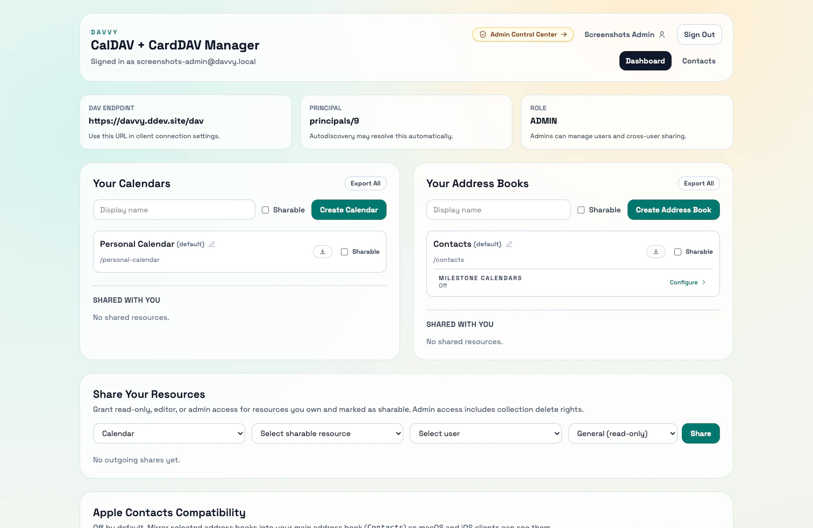
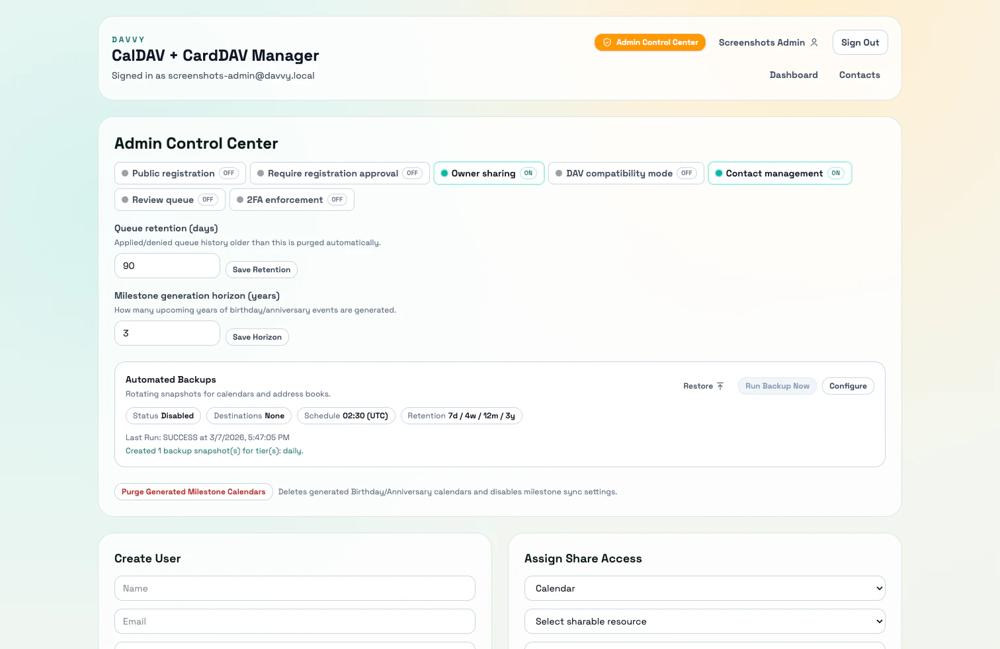
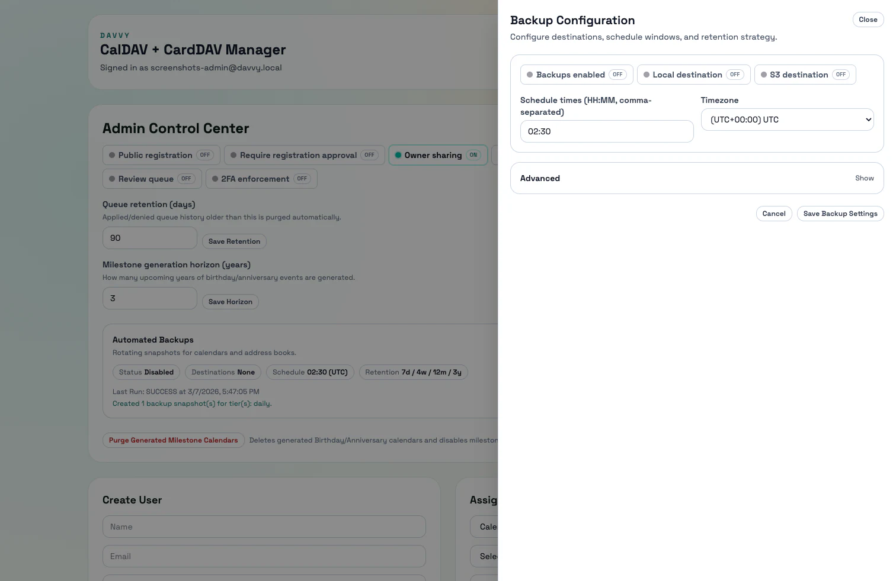

# Davvy ✨

[](https://github.com/kaffolder7/davvy/actions/workflows/lint-checks.yml) [](https://github.com/kaffolder7/davvy/actions/workflows/release-image.yml) [](https://github.com/kaffolder7/davvy/releases/latest) [](https://github.com/kaffolder7/davvy/blob/main/LICENSE)

Davvy is a Laravel + React app that combines a web admin/dashboard experience with a built-in SabreDAV CalDAV/CardDAV server.

It is designed for:
- Multi-user calendar and address-book hosting
- Share-based collaboration (`read_only`, `editor`, `admin`)
- Browser-based administration and operational controls
- DAV client interoperability with strict validation plus compatibility mode when needed
- Automated rotating backups (local + optional S3) with restore tooling

## Screenshots 🖼️

| Login | Dashboard |
| --- | --- |
|  |  |
|  |  |

## Core Capabilities 🚀

### Identity and Access 🔐
- Session-based web auth (`/api/auth/*`)
- Optional TOTP two-factor auth with backup codes
- Optional org-wide 2FA enforcement with grace period
- DAV basic auth at `/dav`
- DAV app passwords for CalDAV/CardDAV clients when 2FA is enabled
- Roles: `admin`, `regular`
- Feature flags controlled by admins (public registration, owner sharing, contact management, review queue moderation, DAV compatibility mode)
- Admin user lifecycle controls, including typed-confirm account deletion with optional ownership transfer
- Admin backup controls for schedule, destinations, retention strategy, and ZIP restore import

### Calendars and Address Books 🗓️
- Default `Personal Calendar` and `Contacts` resources provisioned for each new user
- Owned + shared resource visibility in web dashboard
- Create, rename, mark sharable, and export resources
- Per-resource permission enforcement for web and DAV access

### Sharing 🤝
- Share permissions:
  - `read_only`: view only
  - `editor`: write/update, no collection delete
  - `admin`: full write + collection delete
- Owner-managed sharing can be globally disabled by admin
- Admin global sharing controls across all users/resources

### Contacts and Advanced Workflows 👥
- Managed contact UI (feature-gated)
- Contact writes synchronized to vCards in assigned address books
- CardDAV writes synchronized back into managed contacts
- Bidirectional related-name sync with inverse family mapping, pronoun-aware gendered labels, and neutral fallbacks when pronouns are not inferable
- Optional contact change moderation queue for cross-owner edits (opt-in, default off for personal deployments)
- Birthday/anniversary generated milestone calendars per address book, including combined couple anniversaries when relationships are mutually linked
- Apple compatibility mirror mode (selected sources mirrored into user's default `contacts` book)

### DAV and Interoperability 🔌
- CalDAV/CardDAV endpoint: `/dav`
- Autodiscovery redirects:
  - `/.well-known/caldav`
  - `/.well-known/carddav`
- Sync-token incremental change tracking (`added`, `modified`, `deleted`)
- Strict payload validation by default (toggle compatibility mode for legacy clients)

### Runtime and Deployment 🛠️
- Docker-first runtime with preflight checks (`php artisan app:preflight`)
- Built-in scheduler worker support (`RUN_SCHEDULER=true`) for periodic jobs
- Automated backup tiers with rotating retention (`daily`, `weekly`, `monthly`, `yearly`)
- Restore snapshots via CLI (`app:backup:restore`) or Admin Control Center import flow
- Railway and Coolify deployment support
- PostgreSQL advisory-lock startup bootstrap for multi-replica safety

## Documentation Map 📚

- [Documentation Index](docs/README.md)
- [User Guide](docs/user-guide.md)
- [API Reference](docs/api.md)
- [DAV Client Setup](docs/clients.md)
- [Architecture](docs/architecture.md)
- [Configuration Reference](docs/configuration.md)
- [Deployment Guide](docs/deployment.md)
- [Release Checklist (Core)](docs/release-checklist-core.md)
- [Troubleshooting](docs/troubleshooting.md)
- [Release Checklist (Railway)](docs/release-checklist.md)
- [Release Checklist (Coolify)](docs/release-checklist-coolify.md)

## Quick Start (Docker Compose) 🐳

The repository `compose.yml` is tuned for production-style deployment (including Coolify magic variables).

For local development, prefer the DDEV flow below. If you still want local Docker Compose:

1. Provide required environment values (for example in `.env`):
   - `APP_KEY=base64:<generated-key>`
   - `SERVICE_URL_APP=http://localhost:8080`
   - `SERVICE_USER_POSTGRES=<db-user>`
   - `SERVICE_PASSWORD_POSTGRES=<db-password>`
2. Optionally enable bootstrap admin creation:
   - `RUN_DB_SEED=true`
   - `DEFAULT_ADMIN_EMAIL=<admin email>`
   - `DEFAULT_ADMIN_PASSWORD=<strong password>`
3. Start app + database:

```bash
docker compose up --build
```

If you need host-accessible ports locally, uncomment the `ports` mappings in `compose.yml`.

## Local Development (DDEV) 💻

```bash
ddev start
ddev composer install
ddev npm install
cp .env.ddev.example .env
ddev artisan key:generate
ddev artisan migrate --seed
```

Create a local admin if needed:

```bash
ddev exec sh -lc "DEFAULT_ADMIN_EMAIL='admin@davvy.local' DEFAULT_ADMIN_PASSWORD='ChangeMe123!' php artisan db:seed --force --no-interaction"
```

Run assets:

```bash
ddev vite
```

Access 🔗:
- App: `https://davvy.ddev.site`
- DAV: `https://davvy.ddev.site/dav`

## Testing ✅

Run test suite:

```bash
ddev artisan test
```

Or via Docker:

```bash
docker build --target ci-test -t davvy-ci-test .
docker run --rm davvy-ci-test
```

## AI-Assisted Pull Request Reviews 🤖

Davvy uses an automated AI reviewer to help surface potential issues in pull requests.  
It analyzes the PR diff and related repository context and may leave inline comments for things like:

- potential security issues
- correctness bugs
- missing tests
- performance concerns
- breaking changes

The AI reviewer is **advisory only** and does not replace human code review.

Maintainers and contributors can re-run the review on a pull request by commenting:
```
/ai review
```
See [AI-Assisted PR Reviews](docs/ai-pr-review.md) for details.

## Deployment 🚢

Davvy is deployed as a Docker image. See:
- [Deployment](docs/deployment.md)
- [Release Checklist (Core)](docs/release-checklist-core.md)
- [Release Checklist (Railway)](docs/release-checklist.md)
- [Release Checklist (Coolify)](docs/release-checklist-coolify.md)

## License 📄

Davvy Source-Available License 1.0 (DSAL-1.0) ([LICENSE](LICENSE))

Commercial internal use is allowed. Selling the software, or offering a
competing hosted service, requires a separate written commercial agreement from
the maintainer.

Contributions are accepted under [CLA.md](CLA.md). See [CONTRIBUTING.md](CONTRIBUTING.md).
Commercial terms can be requested via [COMMERCIAL-LICENSE.md](COMMERCIAL-LICENSE.md).
